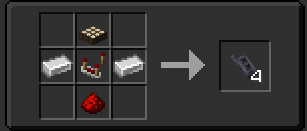

An Interior Detector is used for emitting redstone signals based on different states of the TARDIS.

## How Do I Craft the Interior Detector?

## How Do I use the Interior Detector?

The Interior Detector has 7 modes:
- **Orange** (TARDIS Power is on or not)
- **Green** (TARDIS is crashed or not)
- **Gray** (TARDIS is locked or not)
- **White** (If The TARDIS Doors are open)
- **Blue** (If theres a sonic screwdriver inserted in the Sonic Port)
- **Red** (If The TARDIS alarm is activated)
- **Purple** (If The TARDIS is in flight)

**The Interior Detector** has 2 lights. one on the top and one on the bottom the light on the top indicates the mode its been set to while the light on the bottom indicates if this condtion has been met.

Right clicking on the block will make it change modes, and when the conditions of the mode has been met then it can emit a redstone signal.

You can place the detector on every face of a block, so use it to your hearts content.