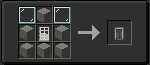

The TARDIS Interior Door is a vital part of the TARDIS, much like the [TARDIS Console](../console), which can be interacted with by a player. You’ll need this to exit your TARDIS, as it’s the barrier between the exterior world and your TARDIS interior. TARDIS doors can be mined and placed through-out the interior wherever the player requires. The door cannot be broken by hand and must be mined with a pickaxe.
## How Do I Create An Interior Door?
Unlike the [TARDIS Console](../console), it is breakable and movable by the player in survival. It's crafted with the recipe in a crafting table below:

## How do I use the Interior Door?
Interacting with the **Interior Door** will change its state, open -> half, half -> both, and both -> closed depending on the door type. If you sneak and interact with the door, it will close it immediately regardless of its open state, and vice versa.

Interacting with the **Interior Door** with a **Linked Key (any type)** will lock the TARDIS and close the **TARDIS Door** if it was open. Interacting with it again will unlock it, but not reopen it.

If you have the **Gold, Netherite & Classic Key** Snapping your fingers (the default keybind is "**V**") will open the **TARDIS Door** however, this requires loyalty.

Opening the **Interior Door** while in flight will cause all living entities(including players) inside the **TARDIS Interior** to be sucked towards the door, sent into the vortex, and dropped out where the TARDIS decides to drop them.

When you're in flight and are near the **Interior Door** you can hear the vortex! When landed (if there's lava or water infront of the TARDIS) you can hear bubbling noises! This also happens if it's raining outside. During flight, you can see the Time Vortex (this is enabled in AIT’s config, using the command /ait-config. You can change what the vortex looks like in the monitor by pressing the buttons next to “hum”). For this, it is recommended you turn on the shields so you don’t get pulled out, and if you disable Protocol 116 (auto-pilot) your TARDIS will spin in the vortex due to the speed you’re going at. 


  The **Interior Door** does not emit a redstone signal, but the TARDIS' exterior does.

