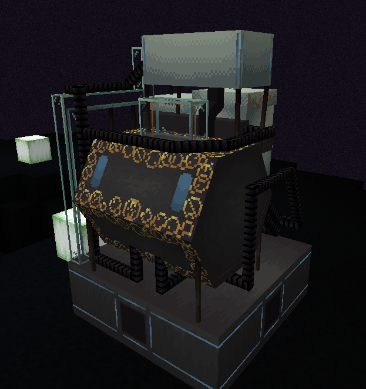

## WHY IS IT SO BIG??

The engine is organic based and will grow based on the amount of components you have connected to it.

## How do i use it?

You place the engine block anywhere inside the tardis and attach components to it by using Artron Cables and the Generalized Subsystem Core block.

## How do i get it?

It is made with a blueprint! (Each item needed is show when placing the blueprint in the fabricator.)

