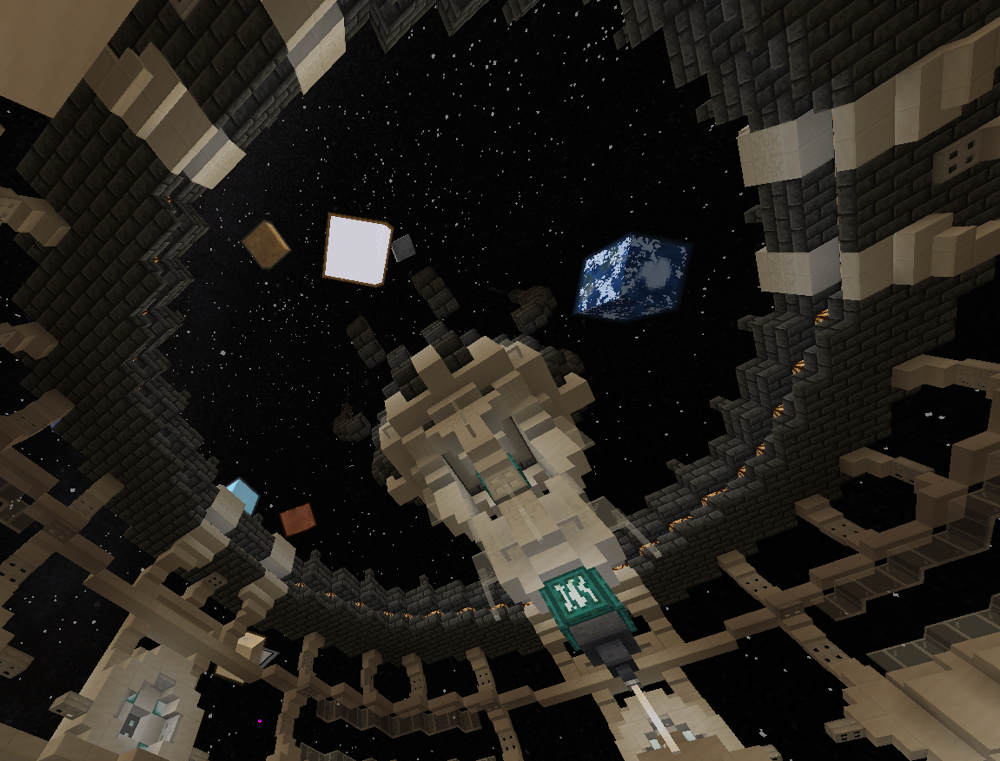

The TARDIS Enviroment Projector is a fun way to change the TARDIS Interior skybox, perfect for your glass-roofed interior or your flashy windows full of dazzling curtains.

This block can display the skybox from any dimension *****as seen below***** (it can even work with other mod's dimensions too! as long as they set it up correctly...)

## How Do I Craft An Enviroment Projector?

## How Do I Use the Enviroment Projector?

Interacting with the block will activate the Enviroment Projector and interacting with it again will disable it. While sneaking and interacting with the Enviroment Projector, it will let you scroll through the available dimensions. This block can only work in the TARDIS and will only display the skybox for that specific **TARDIS interior**.


  This block can be activated and deactivated with a redstone signal.
