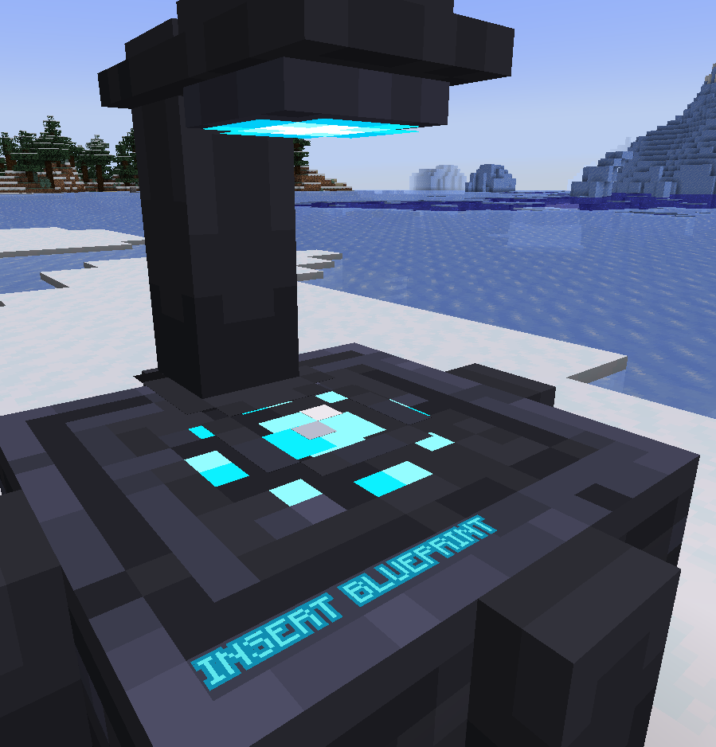

## What Is the Fabricator?
A Fabricator is a machine capable of turning blueprints into usable items. Interacting with it with a blueprint in hand will give it a recipe, and it will require you to input the items it displays in the center. Do note that required item amounts will vary, and the blueprint used will not be used up.

## How Do I Get It To Work?
 Look at the tooltip of the item (hover over it in your inventory). This applies to other items / blocks in the mod although sometimes you might need to hold the shift key!

* You won't need JEI or anything as the fabricator tells you what items you need, but JEI support MAY come in the future.

## Recipe?

