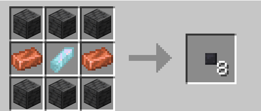

## How do i use these?
This type of fluid link is like a cable,ever played a tech mod?
Yeah basically that,from the engine use fluid links to pump power to wherever you want to,these should normally end up being linked to a [Generalized Subsystem Core](../../blocks/generalized_subsystem_core.md).

## How do i craft it?

