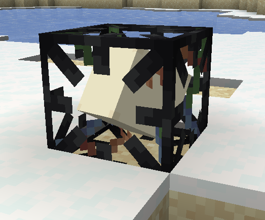
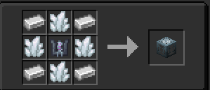

## How Does This Work?

These are used to hold components to be attached to the engine via Artron Cables. Right click to place the component into the Generalized Subsystem Core and Shift + Right Click or mine the block the eject the component from the block.

## How make?
