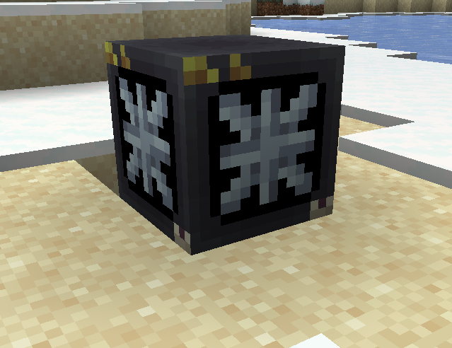
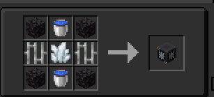

## What Is It Used For?

Since we have planets/space now and you cant really breath on them forever,we added the Oxygenator,place it down and in a 16 block radius you'll be able to breath and have normal gravity in peace and you wont freeze to death either.

## Recipe

