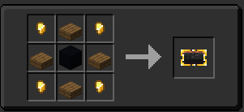

The TARDIS Plaque is used for hanging up the TARDIS information on your wall! It displays information such as TARDIS name and the date it was created. It will only display the information relevant to the current TARDIS and will only work inside the TARDIS interior dimension.

## How to craft The Plaque

