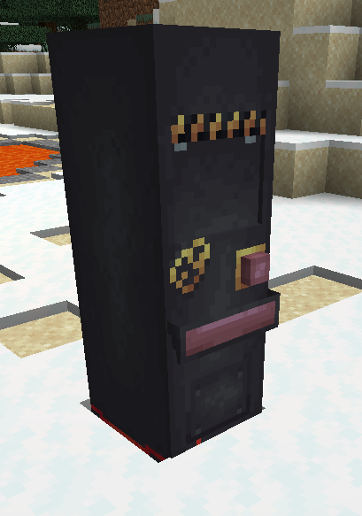
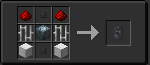

## How Is It Used?
The power converter is used to convert; zeiton shards,fuel items/blocks, and the coral blocks into AU for your TARDIS!
You'll have to link it up to the Engine via Artron Links for it to work though.

## Recipe

