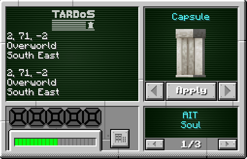
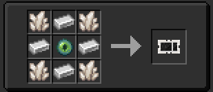
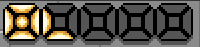
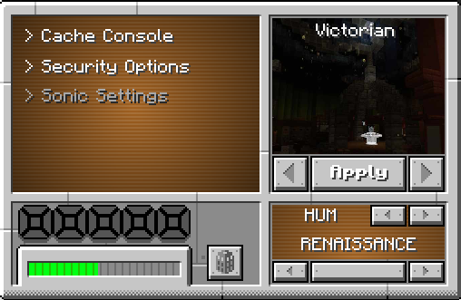

The **Wall Monitor** is another way to change settings, customise your TARDIS and view TARDIS info, but on your wall, giving you those groovy classic vibes!

The TARDIS Menu is included with the [**TARDIS Console**](../console) and the [Monitor](../monitor) but you can craft it as a block and can use it on your wall in your interior.

## Recipe

## Customizing Your TARDIS
In the monitor you can customise your TARDIS to your liking such as, the Exterior, Interior and the Hum. To find out how to change it please see the [**Customizing your TARDIS**](../../mechanics/customizing) page.

## TARDIS Information
When looking at the right side of the monitor it will display a few things, the top will display where your **TARDIS** is in the current dimension with the coordinates, and what direction it's facing too. Next in the middle will display how long your flight is with a progress bar. Then on the bottom will display where your target destination is on the **coordinates display** and also on the bottom left is the [**Artron Energy**](../../mechanics/artron) bar that shows how much energy you have in your **TARDIS**.

## TARDIS Settings Customisation
The menu on the top will say **Settings** click into it and it will preview some options for you to choose, **Cache Console** removes your [**TARDIS Console**](../console) for a **Console Generator** for you to change what console you would prefer. 

**Security** lets you choose what **Security Options** you want and is talked about in this [**TARDIS Security**](../../tardis/security) page. 

Finally the **Sonic Options** allows you to display your **Sonic Data** and change your **Sonic Shell** and is talked about in [**Sonic**](../../items/sonic) page. 

