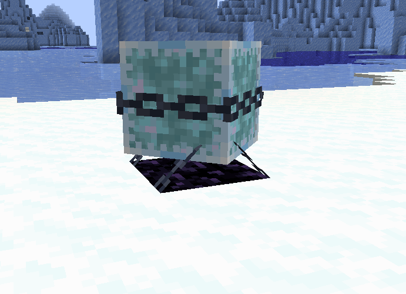
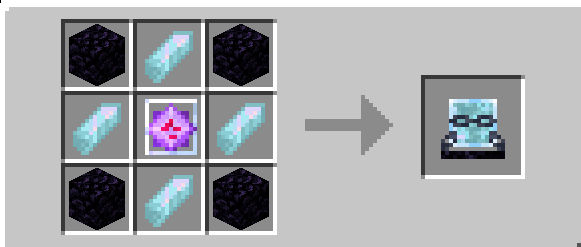

## Whats this used for?
The zeiton cage is used to create the singularity matrix subsystem.
To use it you'll have to
1) Find a rift chunk
2) Place it in the rift chunk
3) Feed it zeiton shards till it reaches 500 AU
4) Throw it into the end void / Use a axe on it to allow it to collapse on itself (CHANGE THIS DEPENDING ON IF LOQOR FINISHED IT OR NOT)
## How do i craft the zeiton cage?
