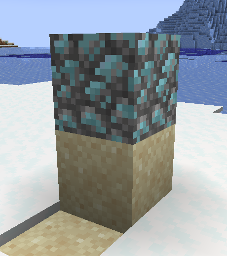
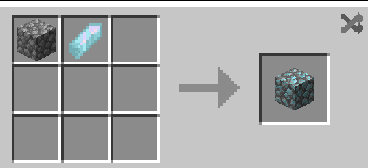

## What Is It Used For?
Since 1.2.0, Zeiton Cobble is used in a single recipe, and is usually used as a decoration block.

## Recipe

> or as an alternative, you can right click Cobblestone with a Zeiton Sshard to convert it into Zeiton Cobble (cool right?).
