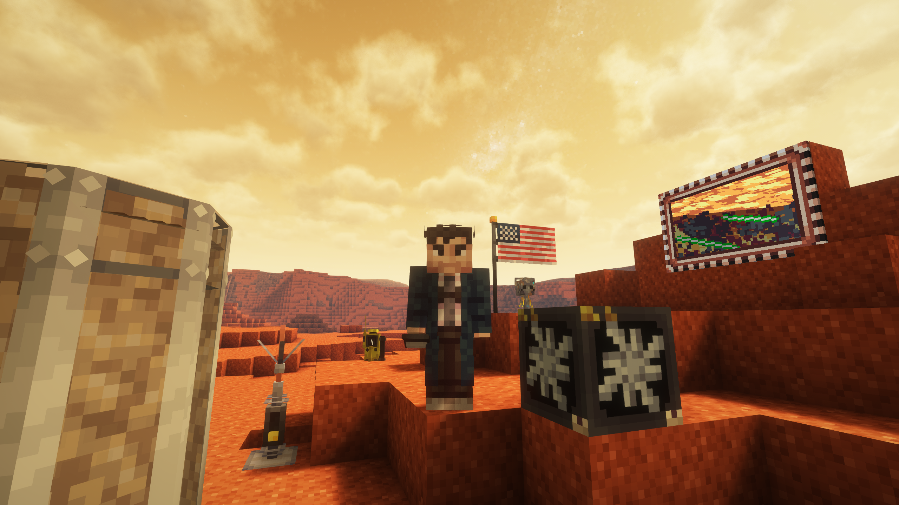

This update revamps and adds The Engine, Sub-Systems, planets, and a plethora of new blocks / items and much more to enhance the minecraft "sci-fi" experience!

## Planets / Structures

- Mars
- Moon
- Space

- Planet Based Cult Structure
- Wrecked Cybership Structure

### Blocks

- Flag
- Mars Blocks; Stairs, Slabs, Ores, Buttons, Walls, Chiseled, Pillars
- Moon Blocks; Stairs, Slabs, Ores, Buttons, Walls, Chiseled, Pillars
- Matrix Energizer
- Astral Map
- Gallifrey Falls
- Tardis Coral Blocks; Block, Stairs, Slab, Fan
- Oxygenator Block
- Engine
- Power Converter
- Generalized Subsystem Core
- Fabricator
- Artron Cable

### Items

- Hazandra
- Psychic Paper
- Hypercube
- Personality Matrix
- Coral Cage
- Coral Fragment
- Plasmic Material
- Superheated Zeiton
- Martian Stone Tools
- Anorthosite Tools
- Handles
- Fabric
- Space Suit Armor
- Blueprints
- Fluid Links; Artron, Data, Vortet
- Mercurial Link; Artron, Data, Vortex
- Components; Orthogonal Engine Filter, Transwarp Resonator, Photon Accelerator, Hyperion Core Shaft
- Subsystem Circuits; Dematerialization, Shields, Backup, Gravitational, Chameleon, Desperation, Stabilisers, Life support
- Skeleton Key

### Interiors

*make*

### Exteriors
*make*

### Consoles
*make*

### TARDIS

* Implemented self-destruct
* i was gonna do this but then i ran out of motivation :sob:

## Changes

### Sonic

*make*

### Textures

*make*

### Lang

*make*

## UI

*make*

## API

*make*

### Others

- Gravity
- Oxygen
 

## Version Changes 1.2.x 
**1.2.9.2823 (July 18th 2025)***
 - everything in 1.2.8
 - fix: TARDIS mode sonic rendering no longer crashes the game | by [@Killarexe](<https://github.com/Killarexe>)
 - fix: hammer uses (instability) speeds up the flight once again | by [@DrTheodor](<https://github.com/DrTheodor>)
 - fix: use a reasonable amount of artron per flight tick | by [@DrTheodor](<https://github.com/DrTheodor>)
 - fix: no more desync issues in some weird cases | by [@DrTheodor](<https://github.com/DrTheodor>)

  ***1.2.7.2820 (June 15th 2025)***
     feat: power converter achievement | by @rapbattlegod32 (#1599)
     feat/monitor-skins | by @MaketendoDev (#1601)
     tweak: Merge Hail Mary toggle-cost into trigger-cost | by @Mansarde (#1605)
     Cave Johnson is now 1 of the possible TARDIS names | by @Saturnorsomthing (#1608)
     Bug Report Automatic Updater | by @MaketendoDev, @invalid-email-address (#1606)
     fix: datapack sounds on servers meowing/erroneous | by @duzos (#1615)
     add: backwards navigation to console generator | by @Mansarde (#1607)
     Fabric permissions api support | by @MaketendoDev, @duzos, @bot, @Loqor, @DrTheodor (#1602)
    
  ***1.2.6.2818 (June 10th 2025)***
     fix: demat alpha being broken & noise playing | by @duzos (#1585)
     fix: datapack sfx not playing | by @duzos, @Loqor (#1586)

  ***1.2.5.2812 (May 21st 2025)***
     perf: improved door waterlog check performance | by @DrTheodor (#1559)
     perf: improved performance of queues/scheduled tasks for world-related jobs | by @DrTheodor (#1559)
     fix: make multidim less error-prone | by @DrTheodor (#1563)
     fix: no more crashes related to subsystems trying to sync themselves to the server | by @DrTheodor (#1564)
     fix: siege should be held-able with TARDIS' created prior to one of the previous releases | by @DrTheodor (#1565)
     add: new splashes | by @DrTheodor (#1567)
     fix: bettercombat/playeranimator compat | by @DrTheodor (#1571)
     Durability for Stat Remotes | by @Loqor (#1572)
     refactor: moved to YACL from cloth | by @DrTheodor (#1568)
     feat: Rani Sonic Screwdriver
     fix(travel): demat sound not cancelling on exterior | by @duzos (#1573)
     fix: cancelling demat doesnt stop sound | by @duzos (#1579)
     feat: alpha fx for handbrake groans | by @duzos (#1574)

***1.2.4.2811(May 21st 2025)***
     fix: more stability | by @DrTheodor (#1505)
     fix: capsule interior door BOTI portal clipping into the blocks behind it | by @Addi3 (#1510)
     fix: fix sonic modes makes double calls | by @Mansarde (#1516)
     Sticky keys | by @MaketendoDev, @Loqor (#1503)
     perf: control entities are no longer living entities | by @DrTheodor, @duzos (#1507)
     perf: improved ticking large amounts of tardises | by @DrTheodor (#1509)
     add: TARDIS locator functionality to sonic scanning mode | by @Mansarde (#1497)
     Electric Discharge now is translatable | by @Saturnorsomthing, @duzos (#1513)
     fix: empty mug is drinkable | by @MaketendoDev, @duzos (#1282)
     feat: made milk mug clear status effects | by @MaketendoDev, @duzos (#1282)
     feat: updated disc textures | by @Saturnorsomthing (#1517)
     chore(sonic): Type 100 -> Frontier | by @duzos (#1518)
     Updated proton flight sound | by @Saturnorsomthing (#1521)
     Updated exterior item texture | by @Saturnorsomthing (#1527)
     fix: hammer no longer bypasses durability check | by @DrTheodor, @Loqor (#1522)
     fix: control entities can be interacted with again | by @DrTheodor, @Loqor (#1522)
     fix: you can interact with slightly broken controls again | by @DrTheodor, @Loqor (#1522)
     Gallifrey Falls Keeps Turning Into Trenzalore, BUT NO MORE I SAY | by @Loqor, @Mansarde (#1533)
     fix: randomizer and structure locator no longer throw up when you rejoin the world | by @DrTheodor (#1544)
     fix: mod no longer collapses when playing with GTceuM | by @DrTheodor (#1542)
     feat: nullable properties | by @DrTheodor (#1537)
     fix: siege mode freezes the players once again | by @DrTheodor (#1538)
     fix: worlds with a lot of tardises will not load all the tardis worlds on start up anymore | by @DrTheodor (#1545)
     fix: "LINK TO ENGINE VIA FLUID LINKS" being wrong name for artron cables | by @Addi3 (#1534)
     fix: tardis' interior no longer ticks if no one is inside or outside (or if the tardis' interior chunks aren't loaded). | by @DrTheodor (#1546)
     fix: if a tardis fails to save it wont brick your world anymore | by @DrTheodor (#1547)
     perf: general performance improvements | by @DrTheodor (#1548)
     tweak: slightly improved biome check of the tardis world | by @DrTheodor (#1549)
     fix: controls were interact-able during growth state, but shouldn't | by @Mansarde (#1551)
     fix: sticky keys could be bypassed via punching / left-clicking controls | by @Mansarde (#1553)
     chore: updated classic_hudolin textures | by @Addi3 (#1554)

  ***1.2.2.2809 (April 26th 2025)***
   - Readds Trenzalore painting
     Fixes sonic item and other remote item translations
     (FINALLY!) Fixed mipmapping
     Added new textures for hartnell console variants
  
  ***1.2.1.2808 (April 26th 2025)***
     ci(changelog): append on merge & reset on release (#1463)
     fix: red warning for experimental versions was shown for release versions (#1462)
     fix(manager): crash when loading & file manager locked (#1459)
     feat(advancement): stat remote advancement (#1457)
     build(ver): 1.2.1-alpha (#1456)
     fix: exterior BOTI doors did not turn red during an alarm when power was off (#1455)
     fix: Hail Mary LED was reversed on Hartnell consoles and now properly indicates protocol 813's status (#1449)
     Temporarly changed easter egg music till dian makes better one (#1446)
     fix: The two Hartnell console variants "exile" and "mint green" are no longer missing emissions. (#1444)
     fix: oxygenator not droping on being mined (#1442)
     feat: Most vortex's utalize layers now (#1441)
     feat: Crystalline vortex! (#1441)
     fix: the hammer no longer crashes dedicated servers (#1438)
     feat: b&t (de)mat (#1311)
     feat: zwip (de)mat (#1311)
     feat: classic (de)mat (#1311)
     feat: drill (de)mat (#1311)
     refactor: exterior animations & their datapacks (#1311)
     fix: rename hammer -> mallet (#1464)
     fix: disabled experimental messages still shown during opening of existing AIT maps (#1470)
     Removed pottery shards from opinions (#1468)
     fix: unused warning-message and missing -title (as well as some wording) (#1473)
     feat: indicate that control is on cooldown (#1466)
     add: max range of 256 blocks for sonic summon (#1485)
     Mad man music for easter egg (#1486)
     feat: after reconfig, steam particles spawn (#1461)
     feat: /ait door_particle command to spawn your own (#1461)
     feat(sonic): overload can light nether portals (#1465)
     tweak(sonic): overload consumes 2x fuel (#1465)
     fix(sonic): stacking above 1 (#1465)
     feat: added music disc insertable tag (#1483)
     Mini Addititons (#1401)
     fix: remove barrier blocks on engine break (#1267)
