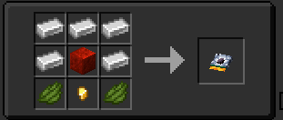

## Waypoint Cartridges?
These can be used to save coordinates for a later date, or to share coordinates with friends. They also have the ability to be customized either by naming them in an anvil or dyeing them with any color in the game (only when they have set coordinates saved!). To see what coordinates are saved onto the cartridge, hover over it in your inventory and hold `shift`.

## How to set a waypoint

1. Hold the waypoint item.
2. `Right click` on the `console port` on the console.
3. Click the `save waypoint` button on the console (the waypoint will then drop on the floor). 

## How to load a waypoint

1. Hold the waypoint item.
2. `Right click` on the `console port` on the console.
3. Click the `load waypoint` button on the console (the waypoint will then drop on the floor like last time). 
4. See the set coordinates on the monitor.
 - Alternatively, you can use the [Waypoint bank](../../blocks/waypoint-bank) if you have multiple waypoint cartridges! 

## Crafting Recipe

