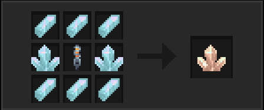

## What is this?

To use it, simply hold the item in your hand while and `right-click` the Artron Collecter Block and it will slowly drain the block.
To fill up your tardis with it, `crouch right-click` the console.

## Why cant i just use normal zeiton?

Normal zeiton hasent been modified to actually be able to hold up the required amount of artron units.

## Well how do i get charged zeiton then?

## Why does it say 0/5000 AU?
The zeiton crystal can hold up to 5000 artron units,which is the required amount for a TARDIS coral to reform its interior for usage,to actually charge it use the artron collector in a rift chunk and harvest the artron units from it.

