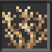
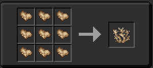

## Coral?

This is the Tardis, it is crafted from Coral Fragments. It is placed on Soul Sand inside of a Rift Chunk. Simular to crops in the game, the Coral Growth is grown in stages over time (this can be sped up by changing the games random tick speed). 

--------------

### How do i finish growing a tardis / console?

Look [HERE](https://amblelabs.github.io/ait-wiki/mechanics/tardis/completing_tardis_growth/) if you want to know how to finish growing the tardis.
### OR
If you want to grow a console look [HERE](https://amblelabs.github.io/ait-wiki/blocks/console/#how-do-i-create--get-a-console).

## Recipe

