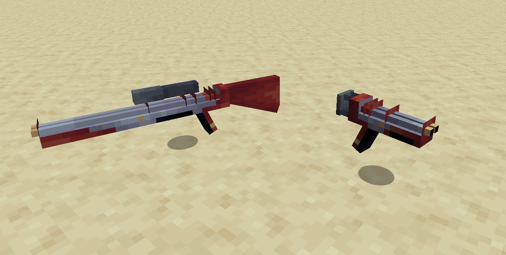
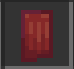

## What are These?

These are the Cult Staser and Cult Staser Rifle, one used for short range and the other for long range attacks. They can be found in chests found in the Cult structures and require Artron Units to work. You can use the Staser Bolt Magazine to refill them (you can tell if it has Artron Units by looking at the item tooltip or listening for a clicking sound when trying to fire)

- You fire with `left click`
- With the Cult Stasers you can also zoom in (the Rifle will zoom in like the Spyglass) by holding `right click`

## How do i give them ammo?

By using the Staser Bolt Magazine (also found in Cult structure chests). To "insert" it, open your inventory and grab the Staser Bolt Magazine then hover over the weapon of your choice and `right click`. But if the Magazine is empty just use it on the console port and it will slowly refill the Artron Units each time you click the port.