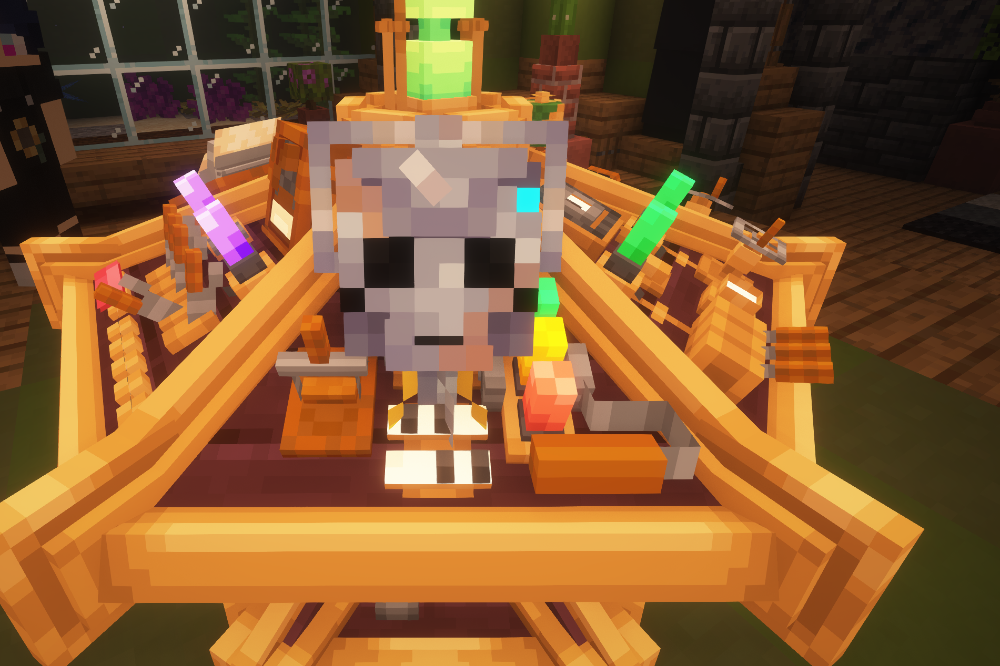

## This is Handles!

Similar to the show,  (using the minecraft chat) Handles can fulfill various tardis related commands. But firstly you need to find him. He can be found in the Wrecked Cybership structure which spawns in Swamp biomes. Once you"ve found him, you"ll need to link him to your Tardis by placing him into the sonic port.

## How Handles Works.

Once placed into the sonic port, he will be able to accept commands given by you. To do so in the in game chat type "Handles" followed by a command you want him to fulfill, Responding with a specific message based on what you ask him to do or an error message if you give him a wrong command. He will also do flight events for you when he's in the Sonic Port.

## Misc stuff
        "help"
        "tell me a joke"
        "tell me a fun fact"

## Demat
        "take off"
        "takeoff"
        "start flight"
        "fly"
        "allons-y"
        "geronimo"
        "demat"
        "dematerialize"

 ## Remat
        "land"
        "stop flight"
        "stop flying"

 ## Shields
        "toggle shields"
        "shields"

## Alarms
        "toggle alarms"
        "alarms"
        "cloister"
        "cloister bells"

## Anti-Gravs
        "toggle antigravs"
        "antigravs"
        "antimavs"
        "gravity"

## Cloak
        "toggle cloak"
        "cloak"
        "p3"
        "protocol 3"

## Open door
        "open doors"
        "open the doors"
        "open"
        "door open"
        "open door"
        "open sesame"

## Close door
        "close the doors"
        "close doors"
        "close"
        "door close"
        "close door"

## Toggle lock
        "toggle lock"
        "toggle door lock"
        "lock"
        "door lock"

 ## Activate handbrake
        "activate handbrake"
        "handbrake on"

## Disable handbrake
        "disable handbrake"
        "handbrake off"

 ## Activate refuel
        "enable refuelling"
        "activate refuelling"
        "activate refuel"
        "refuel"
        "start refueling"
        "refueling on"

 ## Disable refuelling
        "stop refueling"
        "stop refuel"
        "disable refueling"
        "disable refuel"
        "halt refueling process"
        "refueling off"

## Displace
        "displace"
        "waypoint"
        "go to waypoint"
        "fly to waypoint"