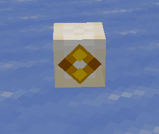
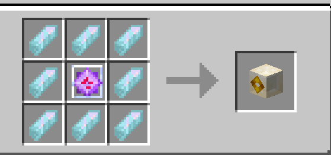

## What is the hypercube?

A way to transmit a SOS signal,when you craft the cube right click and all tardis's will recive a copy of the cube with 100 durability which decreases overtime,to accept it right click the telepathic circuits and the TARDIS will begin tracking the SOS signal redireceting the cords to the originating point of the Hypercube.

Do note that in the SECURITY tab of the TARDIS your able to select if you wish to recive SOS signals or not.

## How do i craft it?

