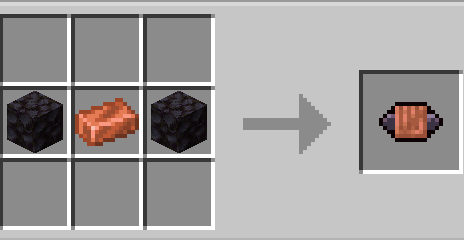
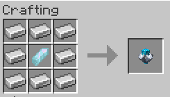

## This page contains information about
* Inductor
* Condenser
* Bulb
* Manipulator
* Artron Fluid Link
* Data Fluid Link
* Vortex Fluid Link
*  Artron Mercurial Link
* Data Mercurial Link
* Vortex Mercurial Link

## What are these things?

These are the new resources that are used to craft things via the fabricator n blueprints.
* All the fluid/mercurial links are made via the fabricator as they have blueprints
* The rest have their own crafting recopies.

## WARNING BULB AND CONDENSER DONT HAVE RECEPIES
+ Here are the recepies of the non blueprint items

