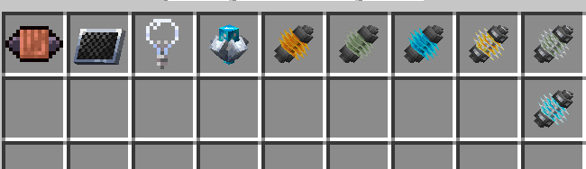
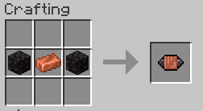
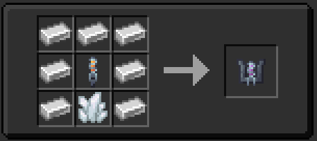
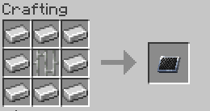
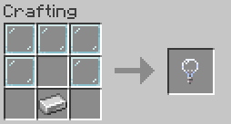

 

## This page contains information about the following;
* Artron Fluid Link
* Data Fluid Link
* Vortex Fluid Link
* Artron Mercurial Link
* Data Mercurial Link
* Vortex Mercurial Link
* Transwarp Resonator
* Orthogonal Engine Filter
* Photon Accelerator
* Hyperion Core Shaft
* Dematerialization Circuit
* Sheilds Circuit
* Backup Circuit
* Gravitational Circuit
* Chamelion Circuit
* Desperation Circuit
* Stabilisers
* Life Support
  
## What are all of these things?

These are the new resources that are used to craft things via the fabricator blueprints. All the fluid/mercurial links are made via the fabricator 
as they have blueprints, the rest have their own crafting recipes.

# Subsystems/circuits
These new subsystems/circuits are needed to activate and or use certain functions of the TARDIS,they'll need power.

## How do i use them?
They are used to access certain functions of the Tardis. How? By inserting them (with `right click`) into the Generalized Subsystem Core.

* WARNING circuits have durability. [**Click me to see how durability works!**](../../mechanics/durability/)

## How do i make them?

Blueprints and the fabricator!

## What each circuit does?

* Demat circuit; needed to demateralize and remateralize.

* Backup circuit; transfers artron to the TARDIS once it runs out of power.

* Chameleon circuit; needed to switch exteriors,cloak and use the adaptive exterior.

* Desperation circuit; allows the usage of siege mode/protocols.

* Gravitational circuit; unlocks anti-mavs and RWF

* Life support; gives constant regeneration within the TARDIS.

* Stabilizers; unlocks P116 (auto-pilot)

* Shield circuit; unlocks both shield types

## Recepies for non blueprint items!

