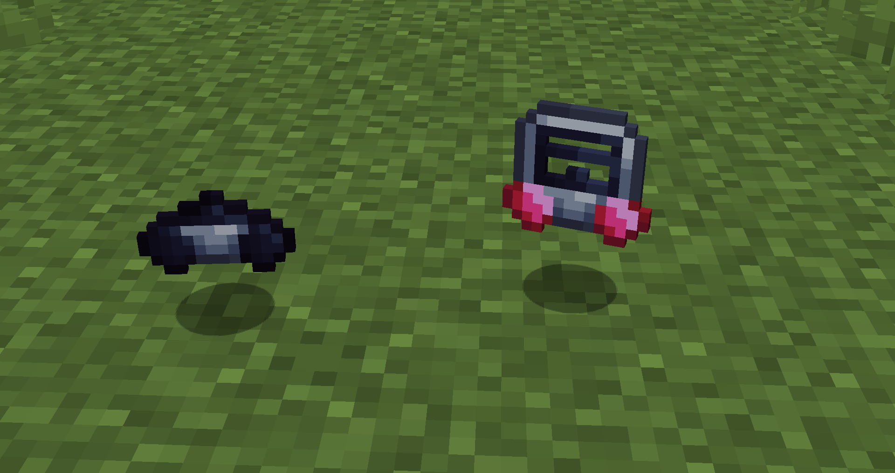
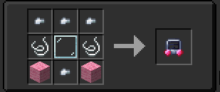
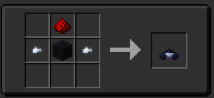

## What Do These Do?

They are very helpful for when you are in either oxygen-less or toxic environments. So you'll either use them when crashed, or before you set up your life support system. They do have limited durability and will break slowly when using them so be careful when fixing stuff! There is also 2 types of respirator; faceless and normal,but they have the same functionality and are both crafted different ways (seen below!)

(also yes the "normal" respirator is a breaking bad reference)

## Recipes

