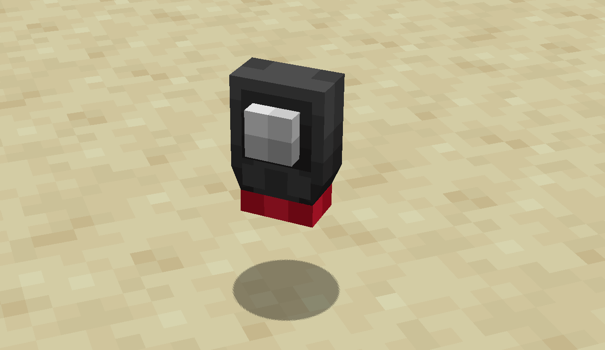
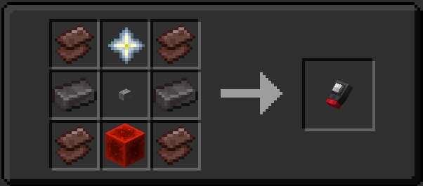

## What does it do?

The Stattenheim Remote is similar to `TARDIS` mode on the Sonic Screwdriver, but this is a bit different, It's range is INFINITE. This means that with the Stattenheim Remote you can summon the TARDIS to you in any dimension and from any distance. Also if you are curious on how long your TARDIS is taking, you can see its flight percentage (to do so hover over the Stattenheim remote in your inventory and hold `shift` this will also let you see if the remote is linked to your TARDIS or not).

# How do I use it?

- First it will need linking to a tardis, this can be done by right-clicking the TARDIS Telepathic Circuits found on your console with the Stattenheim remote in your main hand.

- Next; go to where you want your TARDIS to go, look at the specific block and press `right-click` (you will hear a sound to indicate your tardis is on its way!). **This will not work in the TARDIS dimension**

- As of 1.2.5.2812 the Stattenheim remote now has durability, remember to keep an eye on it when using the remote in your world.

## Crafting Recipe

