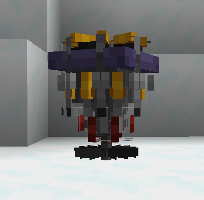
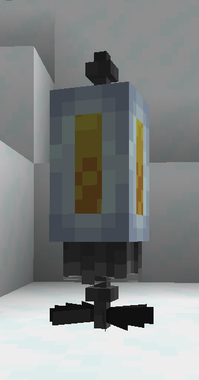
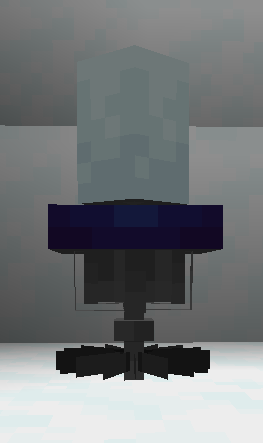
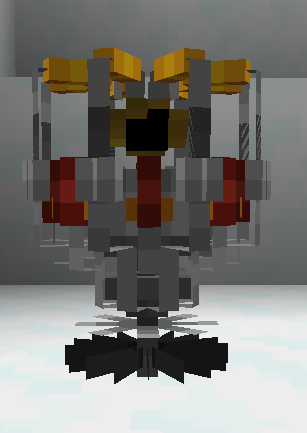
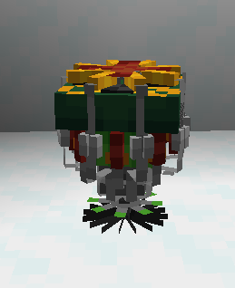
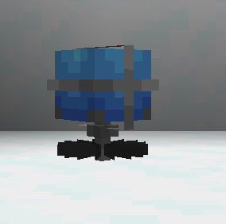
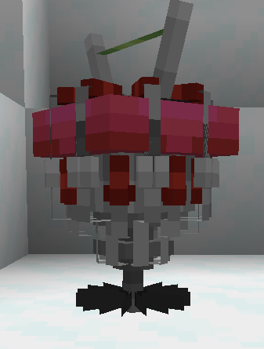

## Subsystems/circuits

These new subsystems/circuits are needed to activate and or use certain functions of the TARDIS,they'll need power.

## How do i use them?

You use them by right clicking a generalized subsystem core to set its type,then build a structure if it has one and then link it up to the engine via fluid links

* WARNING SOME CIRCUITS HAVE DURABILITY,DURABILITY IS EXPLAINED IN MECHANICS.

## How do i make them?

Blueprints and the fabricator!

## What circuits are there and what do they do?

* Demat circuit,needed to demateralize and remateralize.

* Has a structure

* Backup circuit,transfers artron to the TARDIS once it runs out of power.

* Has a structure
‎ ‎ 
‎ ‎ 
‎ ‎ 

* Chameleon circuit,needed to switch exteriors,cloak and use the adaptive exterior.

‎ ‎ 
‎ ‎ 
* Desperation circuit,allows the usage of siege mode/protocols.

‎ ‎ 
‎ ‎ 

* Gravitational circuit,unlocks anti-mavs and RWF (once RWF is implemented)

* Has a structure

‎ ‎ 
‎ ‎ 
* Life support,gives constant regeneration within the TARDIS.

* Has a structure

‎ ‎ 
‎ ‎ 
* Stabalisers,unlocks P116 (auto-pilot)

‎ ‎ 
‎ ‎ 
* Shield circuit,unlocks both shield types

* Has a structure
