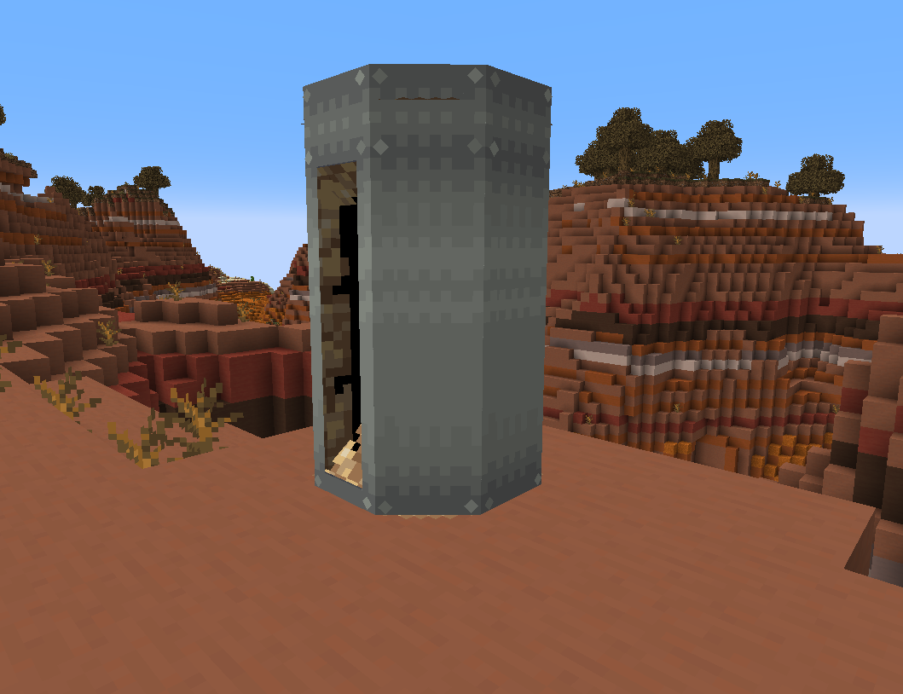
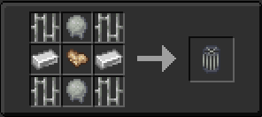
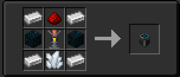

## How do I complete growing the tardis?

(recipes are at the bottom of this page!)

- ### The Coral Shell
 

- Once the coral plant has fully grown, it will become open. Now you need to give it a Coral Cage by right clicking the exterior with a Coral Cage. After that you need to create the cage panels by right clicking the exterior with 8 Plasmic Material. 

- ### The Matrix Engergizer

- Once that is done you need to give the tardis its "personality", to do this you will need to place a Matrix Engergizer on top of a naturally spawned Sculk Shrieker block, Right Click the Matrix Energizer with a Nether Star and activate it by making the Shrieker shriek. Doing so will slowy fill up a bar on the side of the Matrix Engergizer block. ***Remember to keep an eye on your surroundings if you are doing this in the Deep Dark***

- ### The Personality Matrix

- When the bar is full, it will break and drop the Personality Matrix, if you hover over the item and press shift you may notice that is has a random color hex code and random name. Take the Personality Matrix into your newly grown coral and throw it into any water source, you will then be asked to leave the TARDIS so it can finish building.

- ### REMINDER!

Don't forget to set up the engine and essential compenents when the TARDIS is complete. It is also recommended to wear a resporator when first entering a complete TARDIS as there is no life support and you will begin to die upon entering!

## Recipes

### Coral Cage

### Superheated Zeiton

### Plasmic Material

### Matrix Engergizer

