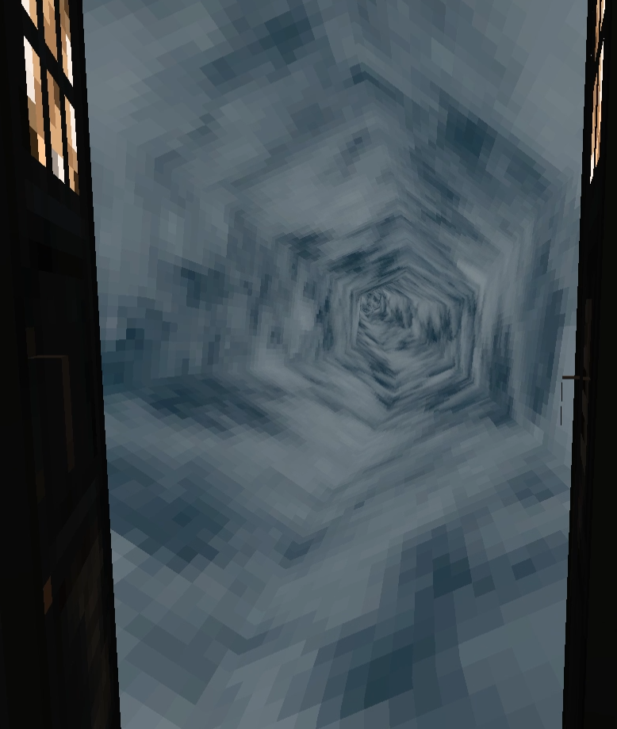

  WARNING,THIS IS ***DISABLED BY DEFAULT***,YOU'LL NEED TO ENABLE IT VIA CONFIG,AND THIS ***DOES NOT WORK WITH SHADERS*** 
* Enable it either via /owo-config ait (scroll down and enable it)
* Or via the config within the files!

## The time vortex!
In the 1.2.0 update we introduced the ***time vortex***,which is very customization and has data pack support,its behind the door and can be viewed by opening them mid flight,and its bigger on the outside!

* Some people have noted that they feel wierd after staring into the vortex for prolonged periods of times,but thats probably nothin.
* It also spins,the higher your throttle speed the faster it spins.

* Here is a video made by tendo showing the vortex off,showing how to change it and such.
https://www.youtube.com/watch?v=RNoBqEpZ_BM

