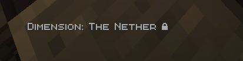
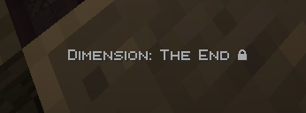

   
   
 

## What Does This Do?
In newer updates, Vanilla dimensions (nether and end) are locked. Why? To add balance to the mod since getting a Tardis is now semi-easier. Each dimension it unlocked is its own unique way. For the nether, `right click` the telepathic circuits with a Blaze Rod. For the End, kill the Ender Dragon (this will unlock the End for everyone, but the nether is unlocked per Tardis)

You can also use datapacks to lock modded / custom dimensions.  [**Click me to see how!**](../datapacks/unlocking.md)